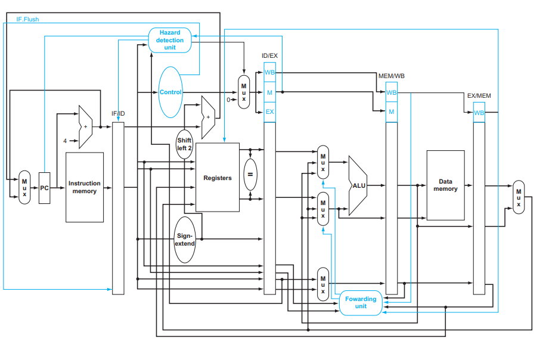

# MIPS 5-Stage Pipeline Project

## Overview

This project involves the implementation and simulation of a MIPS 5-stage pipelined processor using Verilog. The implementation is based on the MIPS architecture as outlined in the "Computer Organization and Design: The Hardware/Software Interface" by David A. Patterson and John L. Hennessy, and further resources from "Digital Design and Computer Architecture" by David M. Harris. This project encompasses adding pipeline registers, simulating the processor, implementing stalls and forwarding, integrating a hazard detection unit, adding the MUL instruction, and applying static branch prediction.

### Project Components

1. **Pipeline Registers**:
   - Four main pipeline registers (IF/ID, ID/EX, EX/MEM, MEM/WB) are implemented to hold the state between each pipeline stage, ensuring seamless instruction flow.
   
2. **Processor Simulation**:
   - The processor is simulated to handle a predefined set of instructions demonstrating no data or control hazards. This helps validate the normal operational behavior of the pipeline.

3. **Stalls and Forwarding**:
   - Implementation includes forwarding mechanisms to resolve data hazards and control logic for stalls when hazards cannot be mitigated by forwarding alone.

4. **Hazard Detection**:
   - A hazard detection unit is integrated to identify and manage potential stalls and hazards dynamically, improving the efficiency of the pipeline under various scenarios.

5. **MUL Instruction**:
   - The MIPS instruction set is extended to include a multiplication (MUL) instruction, which utilizes a dedicated hardware multiplier within the ALU to perform integer multiplication.

6. **Static Branch Prediction**:
   - A simple static branch prediction mechanism assumes that branches are not taken. This prediction strategy helps to optimize the flow control in the pipeline, reducing the penalty from branch mispredictions.

#### Tools and Environment

- **ModelSim**: Utilized for the simulation of the Verilog implementation to test functionality and correctness.
- **QtSpim**: Employed to examine and debug MIPS assembly code corresponding to the implemented features.
- **FPGA Testing**: Hardware implementation and testing are performed on FPGA platforms, showcasing real-world applicability.

#### Additional Resources

For a deeper understanding and more detailed explanations of each component and feature of the MIPS pipeline implemented in this project, please refer to the comprehensive project report titled ["Report.pdf"](./Report.pdf)   available in this repository.

#### Contact Information

For more information or collaboration opportunities, please contact the authors:
- Inbasekaran.P (inba.201ec226@nitk.edu.in)
- Sahit Vankayala (sahitvankayala.201ee149@nitk.edu.in)
